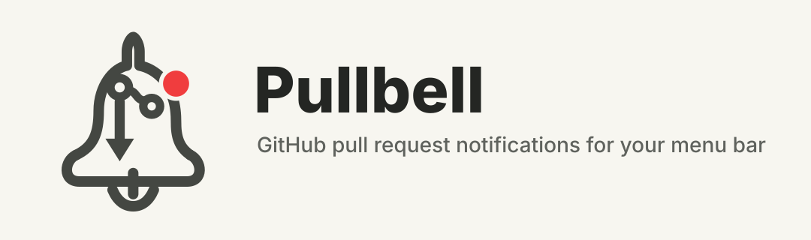

<p align="center">
  
</p>

# Pullbell

Pullbell is a Rust macOS menu bar app for pull request notifications.
It uses GitHub OAuth Device Flow instead of personal access tokens, stores the
OAuth token in macOS Keychain, and polls GitHub for PRs that need attention.

## What this implements

This project follows the same product direction as [Neat](https://neat.run/):
a menu bar first workflow for PR notifications, with local state and minimal
noise. The current implementation includes:

- GitHub OAuth Device Flow sign-in, no PAT required.
- Org/private repository support through OAuth scopes.
- A WebView panel opened from the `PR` menu bar item or `pullbell://show`.
- To do and Done views for review requests, unread PR notifications, and your
  open PRs.
- Keyboard navigation, PR preview, filtering, copy URL, local Done, and Undo.
- GitHub notification thread actions where available, including mark done and
  mute.
- Settings for sign-in/out, update checks, update install, and app actions.
- Desktop notifications for newly seen actionable PR items.
- Token storage in macOS Keychain.
- GitHub Release update checks, Homebrew Cask installation, and restart.
- Unit tests plus macOS CI for formatting, linting, tests, and releases.

## Technical choices

- Rust for the app and GitHub API client.
- `tray-icon` + `tao` for a native macOS menu bar process.
- `reqwest` + `tokio` for GitHub OAuth and REST API calls.
- `keyring` for macOS Keychain storage.
- `mac-notification-sys` for native desktop notifications.
- `wry` for the lightweight in-app WebView panel.

Tauri is intentionally not used. Pullbell keeps a small native tray process and
a focused WebView panel while keeping the GitHub, OAuth, state, and update
modules independent of the UI shell.

## Install

Install with Homebrew:

```sh
brew install urugus/tap/pullbell
pullbell
```

This Formula builds Pullbell locally from source and installs a small launcher
that opens the menu bar app. Because Formula builds do not embed Pullbell's
release OAuth client ID, you may need to configure a local GitHub OAuth App
client ID before signing in. See [GitHub OAuth setup](#github-oauth-setup).

An unsigned prebuilt app bundle is also available as a Homebrew Cask:

```sh
brew install --cask urugus/tap/pullbell
```

You can also download the latest `pullbell-*-apple-darwin.zip` archive from
[GitHub Releases](https://github.com/urugus/Pullbell/releases), unzip it, and
move `Pullbell.app` to `/Applications`.

Pullbell runs as a menu bar app. Open Pullbell, click the `PR` menu bar item,
open Settings, then choose `Sign in with GitHub`.

Pullbell checks GitHub Releases for newer versions and shows an update notice in
the panel when a release is available. When Pullbell is installed as the
Homebrew Cask, Settings can run the Homebrew update in the background, verify
that the expected app version was installed, and restart Pullbell without
opening Terminal. Update logs are written to
`~/Library/Application Support/pullbell/homebrew-update.log`.

Release builds are ad-hoc signed so the app bundle has a valid local code
signature without requiring a paid Apple Developer Program membership. Because
the builds are not notarized, macOS may still require manual approval the first
time you open the app.

If macOS reports that `Pullbell` is damaged, remove the quarantine attribute
from that local build and open it again:

```sh
xattr -dr com.apple.quarantine /Applications/Pullbell.app
```

For local development bundles, you can also ad-hoc sign the generated app:

```sh
scripts/sign-macos-app.sh /path/to/Pullbell.app -
```

## GitHub OAuth setup

Release builds include Pullbell's GitHub OAuth client ID, so users do not need
to create their own GitHub OAuth App.

For local development or custom builds, create a GitHub OAuth App and enable
Device Flow if you want to use a different OAuth app.

Recommended development setup:

1. Open GitHub OAuth App settings.
2. Create or reuse an OAuth App.
3. Enable Device Flow in the app settings.
4. Store the client ID locally:

```sh
mkdir -p ~/.config/pullbell
printf '%s' 'YOUR_GITHUB_OAUTH_CLIENT_ID' > ~/.config/pullbell/client_id
```

You can also launch from a shell with:

```sh
PULLBELL_CLIENT_ID=YOUR_GITHUB_OAUTH_CLIENT_ID cargo run
```

Requested scopes:

- `repo`: needed for private org repositories.
- `read:org`: needed to discover org/team review requests.
- `notifications`: needed to read GitHub notification threads.

GitHub documents the OAuth Device Flow, OAuth scopes, and notifications API in:

- [Authorizing OAuth apps](https://docs.github.com/en/apps/oauth-apps/building-oauth-apps/authorizing-oauth-apps)
- [Scopes for OAuth apps](https://docs.github.com/en/apps/oauth-apps/building-oauth-apps/scopes-for-oauth-apps)
- [REST API notifications](https://docs.github.com/en/rest/activity/notifications?apiVersion=2022-11-28)

## Run From Source

```sh
cargo run
```

Click the `PR` menu bar item, open Settings, then choose `Sign in with GitHub`.
The app opens GitHub's device login page and copies the user code to the
clipboard.

## Raycast Shortcut

Pullbell supports the `pullbell://show` deeplink for showing and focusing the
panel. To assign a keyboard shortcut through Raycast:

1. Create a Raycast Quicklink.
2. Set the name to `Show Pullbell`.
3. Set the link to `pullbell://show`.
4. Assign any hotkey from Raycast Settings under Shortcuts or Quicklinks.

Leave the Raycast hotkey unset if you do not want a keyboard shortcut.

## Panel Shortcuts

- `j` / `k` or arrow keys: move the selected pull request.
- `Enter` / `o`: open the selected pull request.
- `c`: copy the selected pull request URL.
- `Space`: toggle the selected pull request preview.
- `d`: mark the selected pull request done in Pullbell.
- `u`: move the selected done pull request back to To do.
- `m`: mute the selected GitHub notification thread.

## Test

```sh
cargo fmt --check
cargo clippy --all-targets --all-features -- -D warnings
cargo test
```

## Release

Releases are created from version tags.

1. Update `Cargo.toml` and `CHANGELOG.md` for the new version.
2. Commit the release changes.
3. Create and push a tag that matches the Cargo version:

```sh
git tag -a v0.1.0 -m "Release v0.1.0"
git push origin v0.1.0
```

The release workflow verifies formatting, linting, tests, and the tag/Cargo
version match. It then publishes ad-hoc signed macOS app archives for:

- `aarch64-apple-darwin` for Apple Silicon Macs.
- `x86_64-apple-darwin` for Intel Macs.

Each GitHub Release includes a `checksums.txt` file with SHA-256 hashes for the
archives. After the GitHub Release is published, the workflow updates the
Homebrew Formula and Cask in `urugus/homebrew-tap`. The Formula is the default
free install path:

```sh
brew install urugus/tap/pullbell
```

The Cask is the app-bundle install path and is required for in-app updates from
Settings:

```sh
brew install --cask urugus/tap/pullbell
```

The release workflow requires these repository settings:

- Secret `HOMEBREW_TAP_TOKEN`: token with write access to the Homebrew tap
  repository.
- Optional variable `HOMEBREW_TAP_REPOSITORY`: tap repository override. Defaults
  to `urugus/homebrew-tap`.

## Implementation plan

Completed MVP:

- Phase 1: Reference Neat's public behavior: menu bar, focused notifications,
  PR-oriented workflow, local-first state.
- Phase 2: Select Rust with a small native tray stack and focused WebView panel.
- Phase 3: Split app into OAuth, GitHub API, state, storage, panel, and update
  modules.
- Phase 4: Implement To do/Done workflows, preview, shortcuts, Settings,
  notification thread actions, tests, CI, and release automation.

Next phases:

- Add user-configurable polling interval and repo/org filters.
- Persist more panel preferences across restarts.
- Package as a notarized `.app` bundle.
